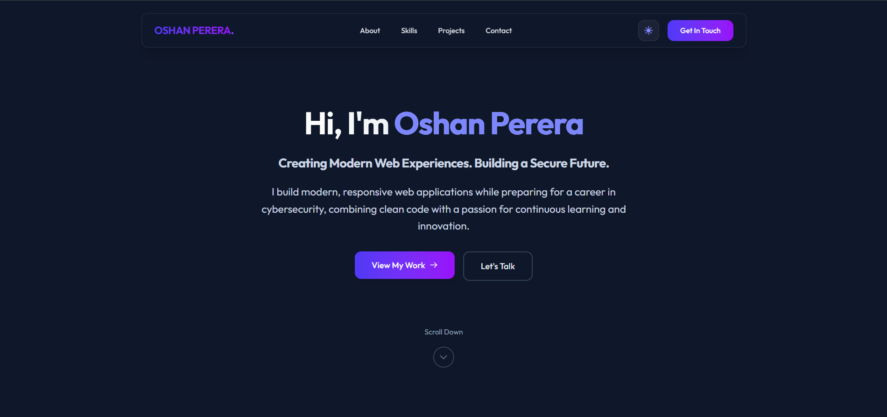
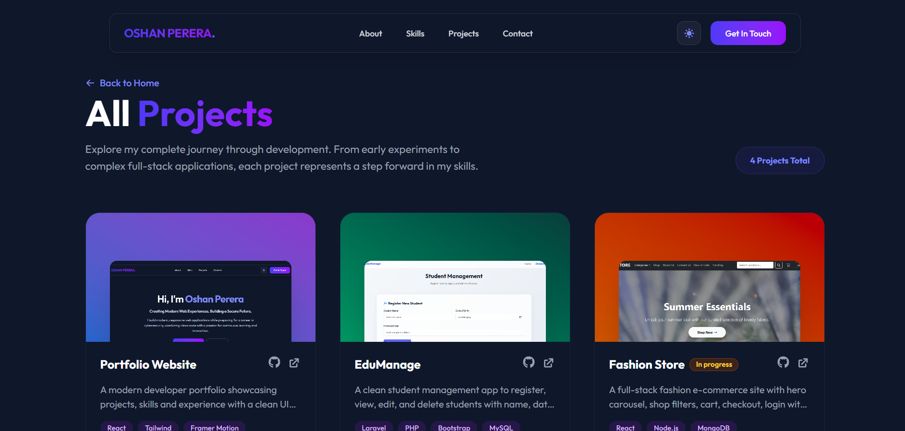
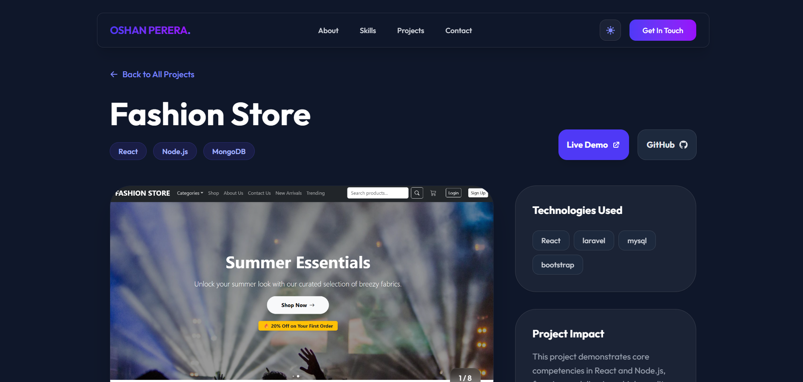

# Oshan Perera - Developer Portfolio

A modern, dynamic, and fully responsive portfolio website built to showcase my projects, skills, and professional experience as a Full Stack Developer. This production-ready application serves as a premium digital resume for potential employers and clients.

## 🎯 Problem Statement

Software developers often struggle with:
- Effectively showcasing complex full-stack projects in a visually appealing way
- Providing a seamless, fast, and responsive user experience to recruiters
- Maintaining an up-to-date digital presence with strong SEO
- Handling direct contact requests easily without a dedicated backend

## 🚀 Solution Overview

This portfolio provides a comprehensive solution with:
- A beautifully designed, highly interactive UI featuring smooth animations
- Dedicated project detail pages with image galleries and technology tags
- Fully functional contact form integrated with Web3Forms (no backend required)
- Built-in SEO optimization for maximum discoverability
- A centralized platform to highlight technical skills and experience

## ✨ Key Features

### Dynamic Showcase
- Interactive hero section with micro-animations
- Dedicated project detail pages with image sliders
- Real-time filtering and elegant page transitions

### User Experience
- Modern, responsive UI with dark mode support
- Glassmorphism design elements and curated typography
- Smooth scrolling and automated navigation handling
- Mobile-first, fluid layout that works on all devices

### Seamless Communication
- Fully integrated contact form with real-time success/error handling
- Direct links to professional social platforms (GitHub, LinkedIn, Instagram)

### Built-in SEO
- Dynamic meta tags and Open Graph data for optimal sharing
- Sitemap and robots.txt pre-configured for search engines

## 🛠️ Tech Stack

### Frontend Core
- **React 19** - Component-based UI library
- **Vite** - Lightning-fast frontend tooling
- **React Router** - Client-side routing

### Styling & Animations
- **Tailwind CSS v4** - Utility-first CSS framework
- **Framer Motion** - Production-ready animation library
- **React Icons** - Comprehensive icon suite

### Utilities
- **React Helmet Async** - Dynamic SEO management
- **Web3Forms** - Form submission handling

### Deployment
- **GitHub Pages** - Fast and reliable static hosting
- **gh-pages** - Automated deployment workflow

## 🏗️ System Architecture
```text
├── React (Frontend)
│   ├── Pages (Home, Projects, Project Detail)
│   ├── Components (Navbar, Footer, Section, Cards, SEO)
│   └── Routing (React Router DOM)
├── Data Layer
│   └── Local Project Data (data/projects.js)
├── Assets
│   └── Images & Icons
└── Deployment Environment (GitHub Pages)
```

## 📸 Screenshots

### Home Page


### All Projects Page


### Project Details Page



## 🚀 Installation Guide

### Prerequisites
- Node.js 16+
- npm or yarn

### Setup Instructions

1. **Clone the repository**
   ```bash
   git clone https://github.com/oshanperera03/portfolio.git
   cd portfolio
   ```

2. **Install dependencies**
   ```bash
   npm install
   ```

3. **Run the development server**
   ```bash
   npm run dev
   ```

Access the application by opening the localhost URL provided in your terminal (usually `http://localhost:5173`) in your browser.

## 📂 Project Structure

```text
portfolio/
├── public/               # Static assets (sitemap, robots.txt)
├── src/                  # Main application source
│   ├── assets/           # Images and static files
│   ├── components/       # Reusable React components (Navbar, Footer, etc.)
│   ├── data/             # Static project data
│   ├── pages/            # Page components (Home, Projects, ProjectDetail)
│   ├── App.jsx           # Main routing component
│   ├── index.css         # Global styles and Tailwind imports
│   └── main.jsx          # React entry point
├── index.html            # Main HTML template
├── package.json          # Project metadata and dependencies
└── vite.config.js        # Vite bundler configuration
```

## 🔒 Security & Best Practices

- **Form Security**: Contact form submissions are securely routed via Web3Forms without exposing sensitive backend endpoints.
- **HTTPS**: Fully enforced on GitHub Pages deployment.
- **Component Isolation**: Strict React component architecture to prevent UI leakage and improve maintainability.
- **Accessibility**: Standard aria-labels and semantic HTML structure implemented.

## 🤝 Contributing

1. Fork the repository
2. Create a feature branch (`git checkout -b feature/AmazingFeature`)
3. Commit your changes (`git commit -m 'Add some AmazingFeature'`)
4. Push to the branch (`git push origin feature/AmazingFeature`)
5. Open a Pull Request

## 👥 Author & Credits

- **Developer**: Oshan Perera
- **Built With**: React, Vite, Tailwind CSS, Framer Motion
